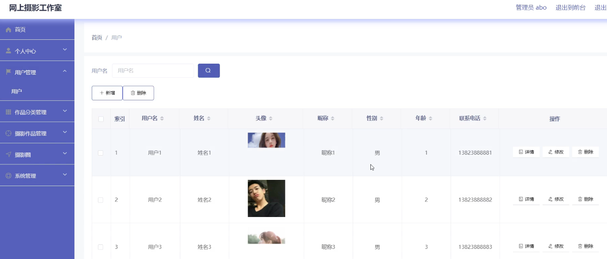
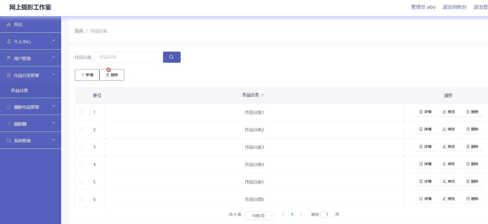
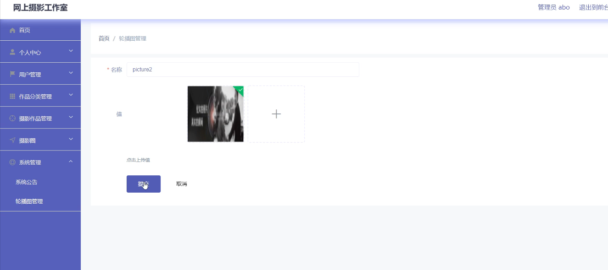
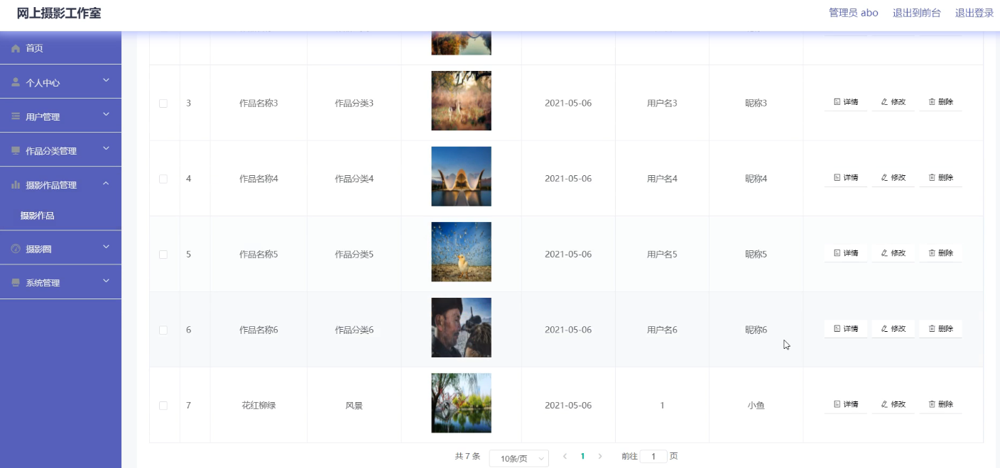
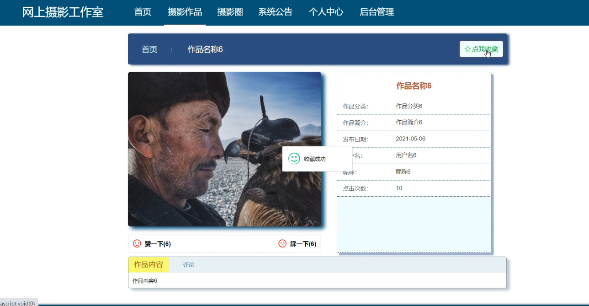
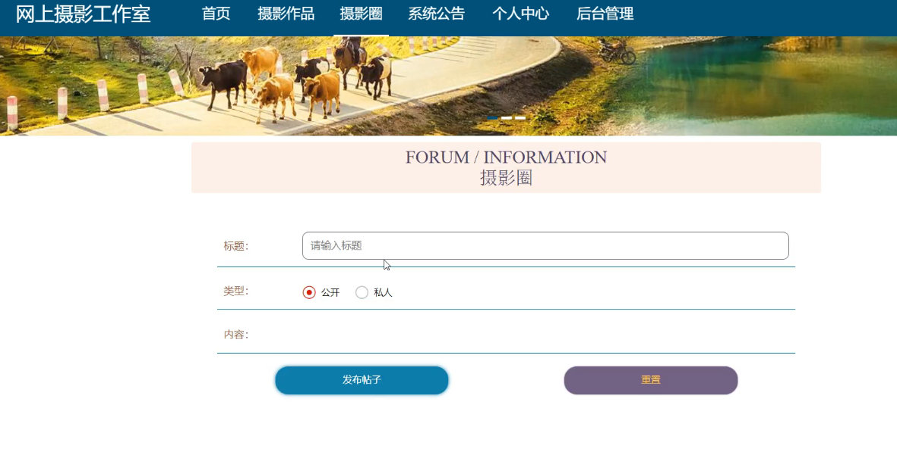
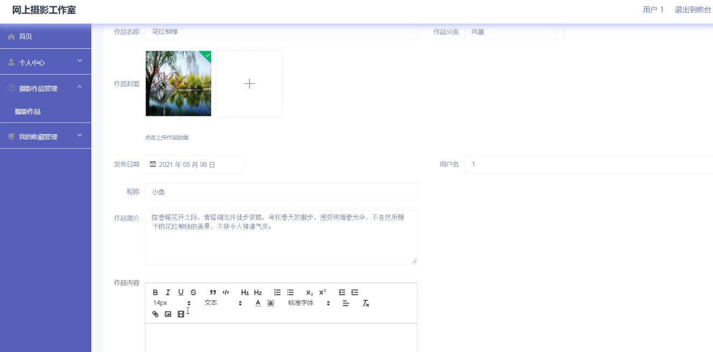

**项目简介：**  
本项目基于主流的前后端分离架构，采用 **SpringBoot + Vue 技术栈**，配套 **MySQL 数据库**，适用于毕业设计与课题实训开发。  
本人已整理了超 **4000 多套毕业设计源码+论文+开题报告+PPT...**，涵盖 **Java、SpringBoot、Vue、SSM、uni-app 小程序、PHP、Android** 等方向，支持功能修改定制与论文服务。  
**团队提供以下服务：**  
- 项目代码修改与调试  
- 数据库配置与远程协助  
- 论文定制与修改  
**获取更多的4000多套源码或SQL文件请联系：**  
- QQ：3906443360 微信：BesheHelp

## springboot098基于web的网上摄影工作室的开发与实现

**项目简介：**  
本项目基于主流的前后端分离架构，采用 **SpringBoot + Vue 技术栈**，配套 **MySQL 数据库**，适用于毕业设计与课题实训开发。  
本人已整理了超 **4000 多套毕业设计源码+论文+开题报告+PPT...**，涵盖 **Java、SpringBoot、Vue、SSM、uni-app 小程序、PHP、Android** 等方向，支持功能修改定制与论文服务。  
**团队提供以下服务：**  
- 项目代码修改与调试  
- 数据库配置与远程协助  
- 论文定制与修改  
**获取更多的4000多套源码或SQL文件请联系：**  
- QQ：3906443360 微信：BesheHelp**

# 系统实现与系统测试

# 概念模式的设计方法是在需求分析的基础上，用概念数据模型（例如E-R模型）表示数据及数据之间的相互联系，设计出反映用户信息需求和处理需求的数据库系统概念模式。概念设计的目标是准确描述应用领域的信息模式，支持用户的各种应用，这样既容易转换为数据库系统逻辑模式，又容易为用户理解。数据库系统概念模式是面向现实世界的数据模型，不能直接用于数据库系统的实现。在此阶段，用户可以参与和评价数据库系统的设计，从而有利于保证数据库系统的设计与用户的需求相吻合。在概念模式的设计中，E-R模型法是最常见的设计方法。本系统的E-R图如下图所示：

（1）管理员信息的实体属性图如下：

图4.12  管理员信息实体属性图

（2）作品作品分类实体属性图如图4.13所示：

图4.13  作品作品分类实体属性图

（3）系统公告信息实体属性图如图4.14所示：

图4.14 系统公告信息实体属性图

4.3.2数据库设计表

网上摄影工作室需要后台数据库，下面介绍数据库中的各个表的详细信息：

表4.1 摄影作品评论表

表4.2 摄影圈

表4.3 系统公告

表4.4 摄影作品

表4.5 收藏表

表4.6 管理员表

表4.7 用户

表4.8 作品分类

5系统详细实现

5.1 管理员模块的实现

5.1.1 用户信息管理

网上摄影工作室的系统管理员可以管理教师，可以对用户信息修改删除以及查询操作。具体界面的展示如图5.1所示。

图5.1 用户信息管理界面

5.1.2 作品分类管理

系统管理员可以查看对作品分类进行添加，修改，删除以及查询操作。具体界面如图5.2所示。

图5.2 作品分类管理界面

5.1.3 轮播图管理

系统管理员可以对轮播图信息进行添加，修改，删除以及查询操作。界面如下图所示：

图5.3 轮播图信息管理界面

5.1.4 摄影作品管理

系统管理员可以对用户提交的摄影作品进行添加修改删除操作。界面如下图所示：

图5.4 摄影作品管理界面

5.2 用户模块的实现

5.2.1 摄影作品收藏

用户登录后可以对摄影作品进行收藏操作。界面如下图所示：

图5.5 摄影作品收藏界面

5.2.2 摄影圈

用户登录后可以在摄影圈发布信息。界面如下图所示：

图5.6 摄影圈界面

5.2.3 摄影作品发布

用户可以发布自己的摄影作品信息。界面如下图所示：

图5.7 摄影作品发布界面

